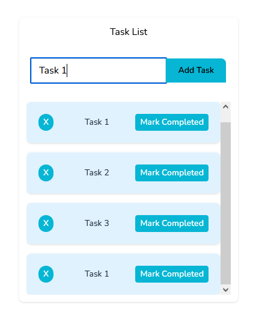

# About The Project

Simple and easy-to-use task list app that displays a TODO list.
Kept simple but robust for deeper abstractions. From development environment, API, FE and tests.

API integration and UI exhibits the following:

* Clear separation of concerns by keeping services and controller logic handling separate.
* Interfaces are maintained to keep services open to extension, closed to modification.
* Built with Docker and Vite for ease of development and deployment.
* React handles operative sorting and data handling, pushing less load to backend calls and db transactions.
* Baseline error handling for both API and FE.
* Typescript, coz strict-typing is awesome.

- Built With
- [x] Laravel
- [x] ReactJS
- [x] Vite
- [x] Typescript
- [x] Tailwind
- [x] Docker

# Project Setup

``copy and rename .env.example to <ROOT_DIR>/.env``

```docker-compose up -d --build```

```docker-compose run --rm composer install```

``docker-compose run --rm artisan key:generate``

```docker exec -it php php artisan migrate```

```docker exec -it php php artisan db:seed```

```docker-compose run --rm npm install```

```docker-compose run --rm npm run dev```

note: ```docker-compose run --rm npm run build``` if port allocation error is encountered.

To run tests:
PHPUnit
```docker-compose exec -it php php artisan test```


React Testing Lib-Jest
```docker-compose run --rm npm run test```


Demo

`- Handle added task at end of uncompleted task list`

`- Handle completed tasks remain inactive`


`- Handle sortable uncompleted tasks`

`- Handle remove task`


``Handle Empty List``


``Handle Duplicate through Settings``



